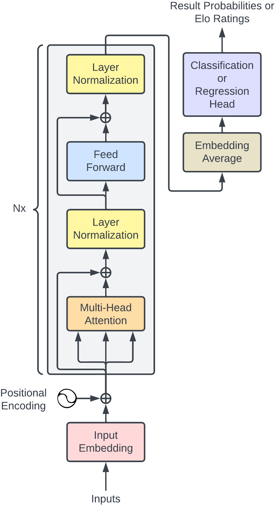

# Chessformer

The goal of this project is to predict the result of a chess game and the Elo
ratings of the players involved solely from the sequence of moves. No additional
information, like captures, checks, or checkmate, is provided. Only the piece
that was moved, from which square, and to which square. The architecture of the
model is shown below and is based on the encoder section of a Transformer. For
more details, including results, see the
[report](report/chessformer_report.pdf).

